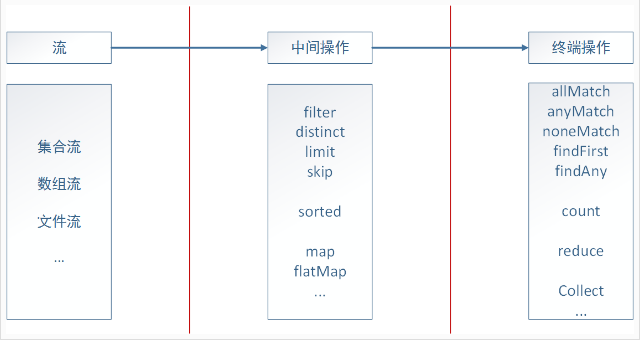

# Java8 新特性之流式数据处理

## 一:流式处理简介

> 在我接触到java8流式处理的时候，我的第一感觉是流式处理让集合操作变得简洁了许多，通常我们需要多行代码才能完成的操作，借助于流式处理可以在一行中实现。比如我们希望对一个包含整数的集合中筛选出所有的偶数，并将其封装成为一个新的List返回，那么在java8之前，我们需要通过如下代码实现：
```
List<Integer> numS = Lists.newArrayList();
for (int i = 0; i < 20; i++) {
    numS.add(Zhou_StdRandom.uniform(1, 674));
}
List<Integer> evens = new ArrayList<>();
for (final Integer num : numS) {
    if (num % 2 == 0) {
        evens.add(num);
    }
}
evens.stream().sorted().filter(integer -> true).forEach(integer -> System.out.println(integer));
```
> 通过java8的流式处理，我们可以将代码简化为：
```
List<Integer> evens = numS.stream().filter(integer -> integer % 2 == 0).collect(Collectors.toList());
```
> 先简单解释一下上面这行语句的含义，stream()操作将集合转换成一个流，filter()执行我们自定义的筛选处理，这里是通过lambda表达式筛选出所有偶数，最后我们通过collect()对结果进行封装处理，并通过Collectors.toList()指定其封装成为一个List集合返回。
 
> 由上面的例子可以看出，java8的流式处理极大的简化了对于集合的操作，实际上不光是集合，包括数组、文件等，只要是可以转换成流，我们都可以借助流式处理，类似于我们写SQL语句一样对其进行操作。java8通过内部迭代来实现对流的处理，一个流式处理可以分为三个部分：转换成流、中间操作、终端操作。如下图：



> 以集合为例，一个流式处理的操作我们首先需要调用stream()函数将其转换成流，然后再调用相应的中间操作达到我们需要对集合进行的操作，比如筛选、转换等，最后通过终端操作对前面的结果进行封装，返回我们需要的形式。

## 二:中间操作

+ 2.1 (过滤，顾名思义就是按照给定的要求对集合进行筛选满足条件的元素，java8提供的筛选操作包括：filter、distinct、limit、skip。)

__filter__

>在前面的例子中我们已经演示了如何使用filter，其定义为：Stream<T> filter(Predicate<? super T> predicate)，filter接受一个谓词Predicate，我们可以通过这个谓词定义筛选条件，在介绍lambda表达式时我们介绍过Predicate是一个函数式接口，其包含一个test(T t)方法，该方法返回boolean。现在我们希望从集合students中筛选出所有武汉大学的学生，那么我们可以通过filter来实现，并将筛选操作作为参数传递给filter：
```
List<Student> whuStudents = students.parallelStream().sorted().filter(student -> "武汉大学".equals(student.getSchool())).collect(Collectors.toList());
whuStudents.parallelStream().forEach(student -> System.out.println(student));
```
__distinct__
> distinct操作类似于我们在写SQL语句时，添加的DISTINCT关键字，用于去重处理，distinct基于Object.equals(Object)实现，回到最开始的例子，假设我们希望筛选出所有不重复的偶数，那么可以添加distinct操作：
```
List<Integer> numS = Lists.newArrayList();
for (int i = 0; i < 1000; i++) {
    numS.add(Zhou_StdRandom.uniform(1, 24));
}
List<Integer> evens = numS.parallelStream().sorted().filter(integer -> integer%2==0).distinct().collect(Collectors.toList());
System.out.println(evens);
```
__limit__
> limit操作也类似于SQL语句中的LIMIT关键字，不过相对功能较弱，limit返回包含前n个元素的流，当集合大小小于n时，则返回实际长度，比如下面的例子返回前两个专业为土木工程专业的学生：
```
List<Student> civilStudents = students.parallelStream().sorted().filter(student -> "土木工程".equals(student.getMajor())).limit(2).collect(Collectors.toList());
civilStudents.parallelStream().forEach(student -> System.out.println(student));
```
__skip__
> skip操作与limit操作相反，如同其字面意思一样，是跳过前n个元素，比如我们希望找出排序在2之后的土木工程专业的学生，那么可以实现为：
```
 List<Student> civilStudents = students.parallelStream().sorted().filter(student -> "土木工程".equals(student.getMajor())).skip(2).collect(Collectors.toList());
 civilStudents.parallelStream().forEach(student -> System.out.println(student));
```
+ 2.2 (在SQL中，借助SELECT关键字后面添加需要的字段名称，可以仅输出我们需要的字段数据，而流式处理的映射操作也是实现这一目的，在java8的流式处理中，主要包含两类映射操作：map和flatMap。)

__map__
> 举例说明，假设我们希望筛选出所有专业为计算机科学的学生姓名，那么我们可以在filter筛选的基础之上，通过map将学生实体映射成为学生姓名字符串，具体实现如下：
```
 List<String> names = students.parallelStream().sorted().filter(student -> "计算机科学".equals(student.getMajor())).map(student -> student.getName()).collect(Collectors.toList());
 System.out.println(names);
```
__flatMap__
> flatMap与map的区别在于 flatMap是将一个流中的每个值都转成一个个流，然后再将这些流扁平化成为一个流 。
```
String[] strs = {"java8", "is", "easy", "to", "use"};
List<String> distinctStrs = Arrays.stream(strs)
        .map(s -> s.split("")).flatMap(strings -> Arrays.stream(strings))// 映射成为Stream<String[]>
        .distinct().collect(Collectors.toList()); // 扁平化为Stream<String>
System.out.println(distinctStrs);
```

## 三:终端操作
__allMatch__
> allMatch用于检测是否全部都满足指定的参数行为，如果全部满足则返回true，例如我们希望检测是否所有的学生都已满18周岁，那么可以实现为
```
boolean isAdult = students.parallelStream().allMatch(student -> student.getAge() >= 18);
System.out.println(isAdult?"是":"否");
```
__anyMatch__
> anyMatch则是检测是否存在一个或多个满足指定的参数行为，如果满足则返回true，例如我们希望检测是否有来自武汉大学的学生，那么可以实现为：
```
 boolean hasWhu = students.parallelStream().anyMatch(student -> "武汉大学".equals(student.getSchool()));
 System.out.println(hasWhu?"是":"否");
```

__noneMathch__
> noneMatch用于检测是否不存在满足指定行为的元素，如果不存在则返回true，例如我们希望检测是否不存在专业为计算机科学的学生，可以实现如下：
```
 boolean noneCs = students.parallelStream().noneMatch(student -> "计算机科学".equals(student.getMajor()));
 System.out.println(noneCs?"是":"否");
```

__findFirst__
> findFirst用于返回满足条件的第一个元素，比如我们希望选出专业为土木工程的排在第一个学生，那么可以实现如下：
```
Optional<Student> optStu = students.stream().filter(student -> "土木工程".equals(student.getMajor())).findFirst();
System.out.println(optStu.get());
```

## 四:常见的操作可以归类如下

__Intermediate(中间)__
```
map (mapToInt, flatMap 等)、 filter、 distinct、 sorted、 peek、 limit、 skip、 parallel、 sequential、 unordered
```

__Terminal(终端)__
```
forEach、 forEachOrdered、 toArray、 reduce、 collect、 min、 max、 count、 anyMatch、 allMatch、 noneMatch、 findFirst、 findAny、 iterator
```

__Short-circuiting(截取)__
```
anyMatch、 allMatch、 noneMatch、 findFirst、 findAny、 limit
```